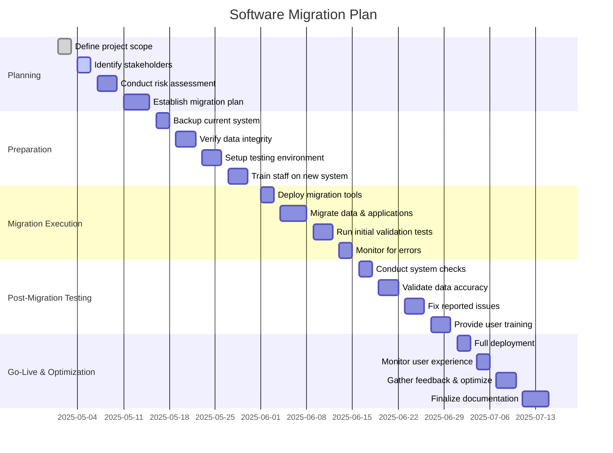
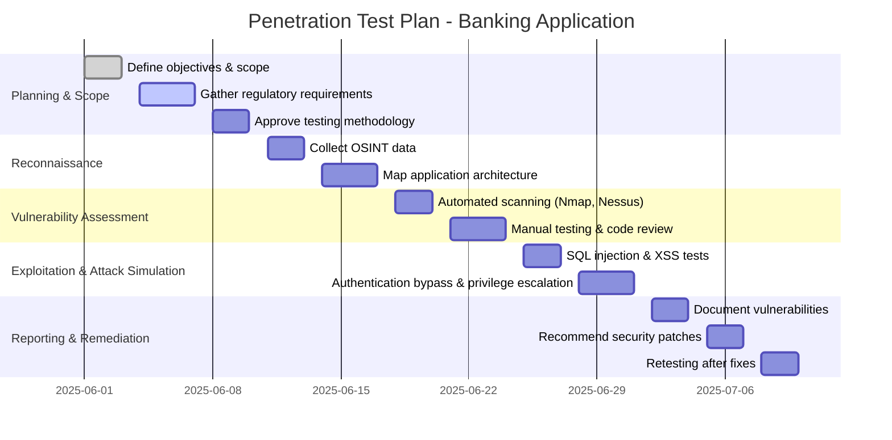

# Architecture planner

## Software Migration

**Software Migration Gantt Chart Overview**
1. **Planning (Week 1–2)**
   - Define project scope
   - Identify stakeholders
   - Conduct risk assessment
   - Establish migration plan & timeline

2. **Preparation (Week 3–4)**
   - Backup current systems
   - Verify data integrity
   - Set up testing environment
   - Train staff on new system

3. **Migration Execution (Week 5–6)**
   - Deploy migration tools
   - Migrate data and applications
   - Run initial validation tests
   - Monitor for errors

4. **Post-Migration Testing (Week 7–8)**
   - Conduct system performance checks
   - Validate data accuracy
   - Fix reported issues
   - Provide user training & support

5. **Go-Live & Optimization (Week 9–10)**
   - Full deployment of new system
   - Monitor user experience
   - Gather feedback & optimize
   - Finalize documentation & best practices

### Gantt 

## Banking security
Banking applications require **robust security measures** to protect sensitive financial data and prevent cyber threats. Here are some **key security principles**:

### **1. Secure Authentication & Authorization**
- **Multi-Factor Authentication (MFA)**: Requires multiple verification steps (password, biometrics, OTP).
- **Role-Based Access Control (RBAC)**: Limits user permissions based on their role.
- **Session Timeouts**: Automatically logs out inactive users to prevent unauthorized access.

### **2. Data Encryption & Protection**
- **End-to-End Encryption**: Ensures data is encrypted during transmission and storage.
- **Tokenization**: Replaces sensitive data with unique tokens to prevent exposure.
- **Secure APIs**: Uses authentication and encryption to protect API communications.

### **3. Fraud Detection & Monitoring**
- **AI-Based Anomaly Detection**: Identifies unusual transactions or login patterns.
- **Real-Time Monitoring**: Tracks user activity for suspicious behavior.
- **Geolocation & Device Recognition**: Flags logins from unknown locations or devices.

### **4. Secure Coding Practices**
- **Input Validation**: Prevents SQL injection and cross-site scripting (XSS) attacks.
- **Regular Security Audits**: Identifies vulnerabilities before attackers do.
- **Code Obfuscation**: Makes it harder for hackers to reverse-engineer applications.

### **5. Compliance & Regulatory Standards**
- **GDPR & PCI-DSS Compliance**: Ensures data protection and secure payment processing.
- **Regular Penetration Testing**: Simulates cyberattacks to test security defenses.
- **Incident Response Plan**: Defines steps to handle security breaches effectively.

Would you like more details on a specific security measure? 🚀 You can also check out [this resource](https://www.infosys.com/digital/insights/Documents/security-basics-financial-applications.pdf) for a deeper dive into financial application security.

## Planning a **penetration test for a banking application** requires a structured approach to identify vulnerabilities and ensure compliance with security standards. Here’s a **step-by-step plan**:

### **1. Define Objectives & Scope**
- Identify critical assets (customer data, transaction systems, APIs).
- Determine testing scope (web apps, mobile apps, network infrastructure).
- Ensure compliance with **PCI-DSS, GDPR, and banking regulations**.

### **2. Reconnaissance & Information Gathering**
- Collect publicly available data (WHOIS, DNS records, employee emails).
- Perform **OSINT (Open Source Intelligence)** to identify potential attack vectors.
- Map out the application architecture and dependencies.

### **3. Vulnerability Assessment**
- Use automated tools (**Nmap, Nessus, Burp Suite**) to scan for weaknesses.
- Identify misconfigurations, outdated software, and weak encryption.
- Prioritize vulnerabilities based on risk level.

### **4. Exploitation & Attack Simulation**
- Conduct **SQL injection, XSS, CSRF, and privilege escalation** tests.
- Attempt **brute-force attacks** on authentication mechanisms.
- Simulate **phishing and social engineering** attacks.

### **5. Post-Exploitation & Impact Analysis**
- Assess **data exposure risks** and unauthorized access possibilities.
- Evaluate **financial fraud risks** and transaction manipulation.
- Document findings with **proof-of-concept exploits**.

### **6. Reporting & Remediation**
- Provide a **detailed penetration test report** with risk assessments.
- Recommend **patches, security updates, and best practices**.
- Conduct a **retest** after fixes are applied.

### **7. Continuous Monitoring & Improvement**
- Implement **real-time threat detection** and security monitoring.
- Schedule **regular penetration tests** to adapt to evolving threats.
- Train employees on **cybersecurity awareness**.

Would you like a **sample penetration test report** or guidance on specific tools? 🚀 You can also check out [this resource](https://cyberhunter.solutions/cyber-security-penetration-testing-for-financial-services-banks/) for more details on penetration testing for financial institutions.

Sure! Here’s a **Mermaid Gantt chart** template for a penetration test plan for a banking application:

This **Mermaid Gantt chart** lays out key steps for a penetration test timeline. You can customize the dates and tasks to fit your project. Let me know if you need adjustments! 🚀
