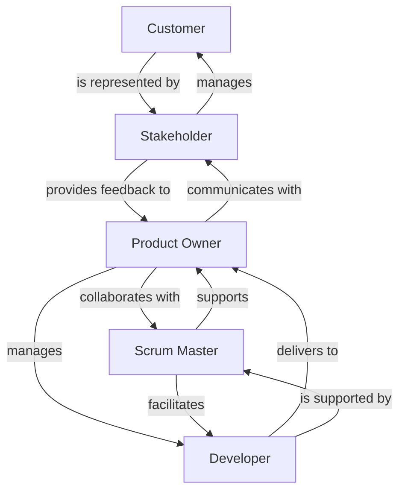
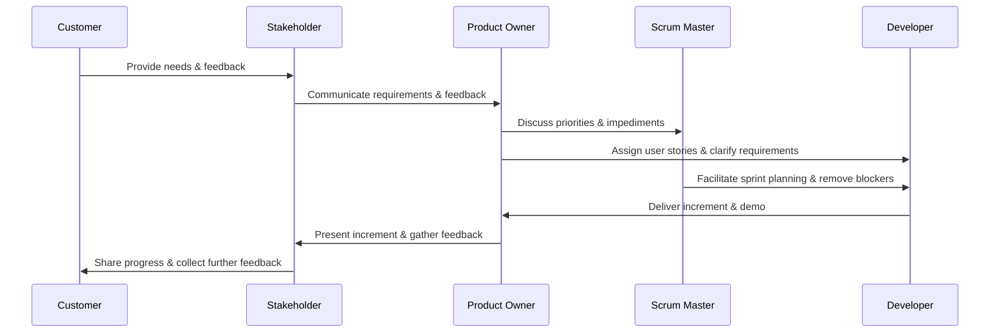

## SCRUM RELATIONSHIPS

```mermaid
flowchart TD
  Customer["Customer"]
  Stakeholder["Stakeholder"]
  ProductOwner["Product Owner"]
  ScrumMaster["Scrum Master"]
  Developer["Developer"]

  Customer -- is represented by --> Stakeholder
  Stakeholder -- provides feedback to --> ProductOwner
  Stakeholder -- manages --> Customer
  ProductOwner -- collaborates with --> ScrumMaster
  ProductOwner -- manages --> Developer
  ProductOwner -- communicates with --> Stakeholder
  ScrumMaster -- facilitates --> Developer
  ScrumMaster -- supports --> ProductOwner
  Developer -- delivers to --> ProductOwner
  Developer -- is supported by --> ScrumMaster
```

## SCRUM RELATIONSHIPS SEQUENCES

```mermaid
sequenceDiagram
    participant Customer
    participant Stakeholder
    participant ProductOwner as Product Owner
    participant ScrumMaster as Scrum Master
    participant Developer

    Customer->>Stakeholder: Provide needs & feedback
    Stakeholder->>ProductOwner: Communicate requirements & feedback
    ProductOwner->>ScrumMaster: Discuss priorities & impediments
    ProductOwner->>Developer: Assign user stories & clarify requirements
    ScrumMaster->>Developer: Facilitate sprint planning & remove blockers
    Developer->>ProductOwner: Deliver increment & demo
    ProductOwner->>Stakeholder: Present increment & gather feedback
    Stakeholder->>Customer: Share progress & collect further feedback
```
